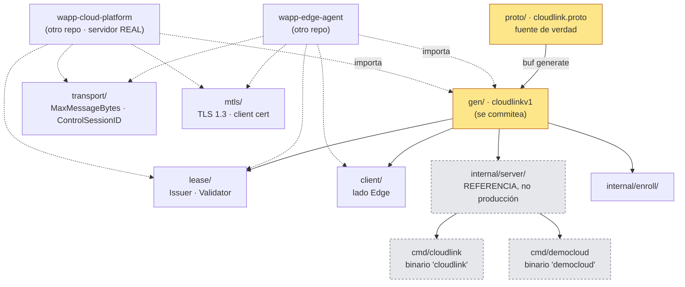
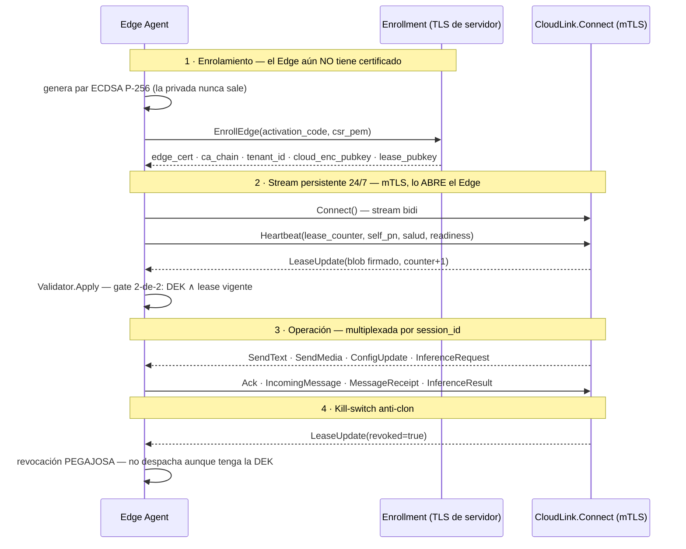

# Arquitectura de `wapp-cloudlink`

> Cómo está hecha por dentro. Las reglas que gobiernan lo que aquí se describe están en
> [`constitucion.md`](constitucion.md); la superficie exacta hacia fuera, en
> [`contratos.md`](contratos.md).

---

## 1. La idea en un párrafo

Este repo tiene **un núcleo y tres anillos**. El núcleo es el `.proto` y su generado: la única
definición del canal Edge↔nube. El primer anillo son los **paquetes públicos que los dos extremos
importan** (`transport/`, `lease/`, `mtls/`, `client/`) — lo que tiene que ser idéntico a los dos
lados. El segundo es la **implementación de referencia** bajo `internal/`, que existe para probar el
contrato de extremo a extremo y para leerse, no para desplegarse. El tercero son los **dos binarios
de arnés**, que solo sirven para el desarrollo local.

**Todo lo que produce valor está en el núcleo y el primer anillo.** Los otros dos existen para que
el núcleo se pueda probar.

---

## 2. Mapa de paquetes

Diez unidades, cada una con su frase. El «público» de la columna derecha significa importable desde
otro repo, con el número de ocurrencias reales medidas en `wapp-cloud-platform` +
`wapp-edge-agent`.

| Ruta | Qué es | Público |
|---|---|---|
| `proto/wapp/cloudlink/v1/` | 🧠 **El núcleo**: `cloudlink.proto`, 783 líneas, la fuente de verdad del paquete proto `wapp.cloudlink.v1`. En su mayoría comentarios de diseño, y eso es deliberado. | fuente |
| `gen/wapp/cloudlink/v1/` | El generado por `buf` (`cloudlink.pb.go` 3.569 L + `cloudlink_grpc.pb.go` 233 L), paquete Go `cloudlinkv1`. **Se commitea a propósito** para que el Edge lo importe cross-repo. | ✅ **101** |
| `transport/` | 🔑 Las constantes que los dos extremos deben saber **iguales**: `MaxMessageBytes` (4 MiB) con sus `ServerOptions()`/`DialOptions()`, y `ControlSessionID`. | ✅ **5** |
| `lease/` | El lease del modelo de doble llave: `Issuer` (firma Ed25519, lado nube) y `Validator` (verifica y aplica el gate 2-de-2, lado Edge), sobre un sobre JSON `{claims, sig}`. **Vive en la raíz, no en `internal/`.** | ✅ **13** |
| `mtls/` | Constructores de `credentials.TransportCredentials` para servidor y cliente: TLS 1.3 mínimo, `RequireAndVerifyClientCert` en el lado servidor, más los cargadores desde fichero. **También en la raíz.** | ✅ **7** |
| `client/` | El cliente Go del **lado Edge**: abre el stream `Connect`, serializa los `Send` y expone un canal de recepción. **No dialga**: recibe una `ClientConnInterface` ya construida. | ✅ **4** |
| `internal/server/` | Implementación de **referencia/demo** del lado nube: la fachada `Server` compone `cloudlinkService` (streams, registro por sesión, inbox acotado, renovación de lease) y `enrollmentService` (`EnrollEdge`). | ❌ por diseño |
| `internal/enroll/` | Enrolamiento: `MemoryStore` de códigos de un solo uso, la `CA` que firma CSRs, y `EnrollClient`, que modela lo que hace el Edge (genera par ECDSA P-256, arma el CSR, canjea). | ❌ por diseño |
| `cmd/cloudlink/` | Binario **`cloudlink`**: servidor standalone que registra los dos servicios en un mismo `grpc.Server`. | — |
| `cmd/democloud/` | Binario **`democloud`**: arnés de «nube de demostración» dirigible por stdin o por fichero, para el e2e contra WhatsApp real. | — |
| `scripts/` · `certs/` | `gen-dev-certs.sh` genera la PKI de desarrollo con `openssl` (CA + servidor + Edge, EC P-256) en `certs/`, que **está fuera de git**. | — |

**Números que ubican**: 7.740 líneas de Go en total, de las cuales **3.569 son el generado** y 696
el test de contrato. El código escrito a mano son ~2.400 líneas.

---

## 3. Topología: quién importa qué



Lo punteado en gris es **arnés**: no se despliega. Los dos repos externos **no importan nada bajo
`internal/`** — verificado con `grep -rn "wapp-cloudlink/internal" --include='*.go'` sobre ambos:
cero resultados.

---

## 4. Capas

1. **Contrato** (`proto/` → `gen/`). Sin lógica. Lo único que se edita a mano es el `.proto`.
2. **Transporte compartido** (`transport/`, `mtls/`). Constantes y credenciales: lo que tiene que
   coincidir byte a byte en los dos extremos.
3. **Política de autorización** (`lease/`). Es la única capa con reglas de negocio, y son cuatro:
   firma válida, no expirado, counter creciente, revocación pegajosa. No conoce gRPC más allá del
   tipo `LeaseUpdate` que produce y consume.
4. **Extremos** (`client/` para el Edge, `internal/server/` como referencia del lado nube).
5. **Arneses** (`cmd/`). Cableado, `os.Getenv` y logs.

La dependencia va siempre hacia arriba: `lease/` importa `gen/`, nunca al revés; `internal/server`
importa `lease` a través de una **interfaz local** (`LeaseIssuer`, `internal/server/server.go:46-48`)
para no acoplarse al paquete.

---

## 5. Ciclo de vida del canal

Es el diagrama que hay que entender antes de tocar nada.



Tres cosas que el diagrama no dice y hay que saber:

- **El stream lo abre el Edge, siempre.** La nube nunca marca hacia el equipo del cliente: no
  habría cómo, detrás de NAT doméstico. Por eso hay keepalive a los dos lados.
- **Un solo stream por Edge, N sesiones dentro.** El multiplexado es por `session_id`, la
  correlación por `command_id`. Un Edge con cinco teléfonos abre **una** conexión.
- **Si el stream cae, el Edge encola en su outbox SQLite** y drena al reconectar. Por eso el
  servidor puede descartar bajo saturación sin perder mensajes de negocio.

---

## 6. Puntos de entrada y binarios

Hay exactamente **dos** `main.go`, y **ninguno se despliega en producción**.

### `cmd/cloudlink/main.go` → binario `cloudlink`

91 líneas. Servidor CloudLink standalone que registra **los dos** servicios en un único
`grpc.Server` (`cmd/cloudlink/main.go:64-69`) — a diferencia de producción, donde son dos listeners
separados. Aplica `transport.ServerOptions()` y el keepalive (`:49`, `:26-37`).

🔴 **Arranca sin mTLS si no encuentra los tres ficheros** `ca.crt`, `server.crt` y `server.key` en
`CLOUDLINK_CERT_DIR` (`:53-62`): la degradación es un `log.Printf`, no un fallo. Un directorio mal
escrito levanta un CloudLink abierto. Solo el hecho de ser un arnés lo excusa; ver
[`deuda.md`](deuda.md).

### `cmd/democloud/main.go` → binario `democloud`

225 líneas. Arnés de «nube de demostración» para el e2e contra WhatsApp real: **siempre insecure y
sin lease, a propósito** (el mTLS y el lease ya están probados aparte; esto enfoca el flujo de
negocio). Loguea cada `EdgeToCloud` que llega y **acepta órdenes por stdin**:

```
send <sessionID> <destino> <texto...>
ping <sessionID>
quit | exit
```

Si `CLOUDLINK_CMD_FILE` está puesta, en vez de stdin hace **tail-poll de ese fichero cada 300 ms**
(`cmd/democloud/main.go:92-115`), lo que permite dirigirlo desde otro proceso.

---

## 7. Cómo funciona el servidor de referencia por dentro

Merece un párrafo porque su diseño de backpressure es la parte no obvia.

`cloudlinkService` mantiene dos mapas por `session_id`: `sessions` (el stream activo, para poder
empujar comandos) e `inboxes` (un buffer acotado, 64 por defecto, para drenar lo que entra).
`deliver` (`internal/server/cloudlink.go:77-98`) es **no bloqueante**: si el inbox de una sesión
está lleno, **descarta el entrante** e incrementa un contador de saturación de esa sesión. Nunca
congela el `Recv`. El precio —perder frames bajo saturación sostenida— es aceptable porque la
durabilidad la da el outbox del Edge.

`deregister` solo borra la entrada **si sigue apuntando a ese mismo `conn`**
(`internal/server/cloudlink.go:225-233`): una reconexión más nueva pudo haber reemplazado el mapeo
con el mismo `session_id`, y borrarla dejaría la sesión viva sin ruta para el kill-switch.

⚠️ Ese mismo fichero contiene tres defectos verificados —una fuga de mapa, una fuga de goroutines y
un inbox compartido bajo la clave vacía— documentados en [`deuda.md`](deuda.md).
